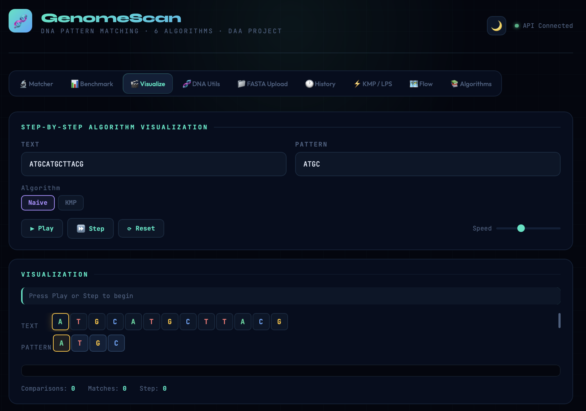

# 🧬 GenomeScan v2.0

<div align="center">


[](https://openjdk.org/)
[](https://spring.io/projects/spring-boot)
[](https://gradle.org/)
[](/)
[](/)
[](LICENSE)

</div>

---

## 📌 Overview

**GenomeScan** is a full-stack DNA sequence pattern matching application implementing **6 string-matching algorithms** with a Spring Boot REST API backend, H2 database persistence, and an interactive dark/light-themed frontend featuring step-by-step algorithm visualization, Chart.js benchmarks, and FASTA file upload.

---

## ✨ Features

| Tab | Description |
|-----|-------------|
| 🔬 **Matcher** | Run any of 6 algorithms on custom genome + pattern input |
| 📊 **Benchmark** | Compare all 6 algorithms with Chart.js bar charts + scaling analysis |
| 🎬 **Visualize** | Step-by-step algorithm visualization with play/pause/step controls |
| 🧬 **DNA Utils** | Bioinformatics tools: complement, reverse complement, GC content, translation, Hamming/Edit distance, k-mer frequency, mutation detection |
| 📁 **FASTA Upload** | Drag-and-drop FASTA file parsing for real bioinformatics workflows |
| 🕐 **History** | Persistent search history stored in H2 database |
| ⚡ **KMP / LPS** | Visualize the KMP Failure Function and Rabin-Karp rolling hash |
| 🗺️ **Flow** | Request flow diagram, design patterns, and architecture overview |
| 📚 **Algorithms** | Reference cards for all 6 algorithms with complexity and use cases |

---

## 🧠 Algorithms Implemented

| Algorithm | Time (worst) | Time (best) | Space | Best For |
|-----------|-------------|-------------|-------|----------|
| **Naive** | O(n·m) | O(n) | O(1) | Small text, simple use |
| **KMP** (Knuth-Morris-Pratt) | O(n+m) | O(n+m) | O(m) | Repetitive patterns, streaming |
| **Rabin-Karp** | O(n·m) | O(n+m) | O(1) | Multi-pattern search |
| **Boyer-Moore** | O(n·m) | O(n/m) | O(σ+m) | Long patterns, large text |
| **Z-Algorithm** | O(n+m) | O(n+m) | O(n+m) | Clean code, cache-friendly |
| **Aho-Corasick** ★ | O(n+m+z) | O(n+m+z) | O(m×σ) | Simultaneous multi-pattern search |

> ★ **Aho-Corasick** is a trie-based automaton with failure links (generalized KMP). It searches for multiple patterns in a single pass — used in gene motif discovery and intrusion detection systems.

---

## 🏗️ Project Structure

```
GenomeScan/
├── frontend/
│   ├── index.html              # Main SPA with 9 tabs
│   ├── script.js               # UI logic, Chart.js, visualization engine
│   └── style.css               # Dark/light theme, animations
│
├── src/main/java/com/example/dna/
│   ├── algorithms/
│   │   ├── StringMatchingStrategy.java   # Strategy Pattern interface
│   │   ├── NaiveStrategy.java
│   │   ├── KmpStrategy.java
│   │   ├── RabinKarpStrategy.java
│   │   ├── BoyerMooreStrategy.java
│   │   ├── ZAlgorithmStrategy.java
│   │   ├── AhoCorasickStrategy.java      # ★ Trie + failure links
│   │   └── Algorithms.java              # Legacy static implementations
│   ├── controller/
│   │   ├── ApiController.java            # REST endpoints with @Valid DTOs
│   │   └── FileController.java           # FASTA file upload
│   ├── dto/
│   │   ├── MatchRequest.java             # Validated request DTO
│   │   ├── BenchmarkRequest.java
│   │   ├── UtilsRequest.java
│   │   └── ApiResponse.java             # Generic response wrapper
│   ├── exception/
│   │   └── GlobalExceptionHandler.java   # @ControllerAdvice
│   ├── model/
│   │   ├── MatchResult.java
│   │   └── SearchHistory.java            # JPA entity
│   ├── repository/
│   │   └── SearchHistoryRepository.java  # Spring Data JPA
│   ├── service/
│   │   └── MatcherService.java           # Strategy Pattern dispatch
│   └── DnaApplication.java
│
├── src/test/java/com/example/dna/
│   ├── algorithms/AlgorithmsTest.java    # 40+ parameterized tests
│   ├── service/MatcherServiceTest.java   # Mockito unit tests
│   └── controller/ApiControllerIntegrationTest.java  # MockMvc tests
│
├── Dockerfile                  # Multi-stage build
├── docker-compose.yml          # Backend + nginx frontend
├── .github/workflows/ci.yml   # GitHub Actions CI/CD
├── build.gradle
└── README.md
```

---

## 🎨 Design Patterns Used

| Pattern | Where | Purpose |
|---------|-------|---------|
| **Strategy** | `StringMatchingStrategy` interface | Pluggable algorithm dispatch without switch-case |
| **MVC** | Controller → Service → Algorithm | Separation of concerns |
| **Repository** | `SearchHistoryRepository` | Data access abstraction with Spring Data JPA |
| **DTO** | `MatchRequest`, `ApiResponse`, etc. | Type-safe request/response with validation |
| **Template Method** | JPA entity lifecycle | Auto-generated SQL from method names |

---

## 🔌 API Endpoints

| Method | Endpoint | Description |
|--------|----------|-------------|
| `POST` | `/api/match` | Run pattern matching with selected algorithm |
| `POST` | `/api/benchmark` | Benchmark all 6 algorithms |
| `POST` | `/api/dna/utils` | Bioinformatics utilities |
| `POST` | `/api/upload/fasta` | Upload and parse FASTA files |
| `GET` | `/api/history` | Get search history |
| `DELETE` | `/api/history` | Clear search history |
| `GET` | `/api/health` | Health check |
| `GET` | `/swagger-ui.html` | Interactive API documentation |

> All endpoints use typed DTOs with `@Valid` bean validation. Errors are handled by `@ControllerAdvice`.

---

## 🚀 Getting Started

### Prerequisites
- Java 17+
- Gradle (or use the included `gradlew` wrapper)

### Run the Backend

```bash
# Clone the repo
git clone https://github.com/Dhruv-Sharma29/GenomeScan.git
cd GenomeScan

# Build and run Spring Boot
./gradlew bootRun
# Server starts at http://localhost:8080
# Swagger UI at http://localhost:8080/swagger-ui.html
# H2 Console at http://localhost:8080/h2-console
```

### Open the Frontend

Just open `frontend/index.html` in your browser.
The UI auto-checks `GET /api/health` and shows the green **API Connected** dot when the backend is up.

### Run Tests

```bash
./gradlew test
# 92 tests: algorithms, service, integration
```

### Docker

```bash
docker compose up --build
# Backend: http://localhost:8080
# Frontend: http://localhost:3000
```

---

## 🧪 Testing

| Test Suite | Count | Framework | Coverage |
|-----------|-------|-----------|----------|
| `AlgorithmsTest` | 40+ | JUnit 5 Parameterized | All 6 algorithms, edge cases, cross-validation |
| `MatcherServiceTest` | 20+ | Mockito | Service dispatch, DNA utilities, history persistence |
| `ApiControllerIntegrationTest` | 12 | MockMvc + SpringBootTest | All endpoints, validation, FASTA upload |

### Cross-Validation
All 6 algorithms are cross-validated: the test verifies that every algorithm returns the **exact same set of match positions** on the same input.

---

## 🏛️ Architecture

```
Browser (frontend/)
    │
    │  POST /api/match  →  MatchRequest DTO (@Valid)
    ▼
ApiController.java            ← HTTP layer, zero algo logic
    │
    ▼
MatcherService.java           ← Strategy Pattern dispatch
    │                           (Map<String, StringMatchingStrategy>)
    ▼
StringMatchingStrategy        ← 6 implementations (Spring @Component)
    │
    ├── NaiveStrategy
    ├── KmpStrategy
    ├── RabinKarpStrategy
    ├── BoyerMooreStrategy
    ├── ZAlgorithmStrategy
    └── AhoCorasickStrategy
    │
    ▼
MatchResult.java              ← { positions, comparisons, timeNs }
    │
    ├──→ SearchHistoryRepository  ← Save to H2 database
    │
    ▼
JSON Response → Frontend renders (Cards, charts, strand viewer)
```

---

## 📖 Algorithm Notes

**KMP Failure Function (LPS Array)**
The LPS (Longest Proper Prefix = Suffix) array lets KMP skip redundant comparisons. On mismatch at index `i`, jump to `lps[i-1]` instead of restarting from zero.

**Rabin-Karp Rolling Hash**
Polynomial hash with DNA alphabet (BASE=4):
`H = Σ (4^i × val(c)) mod 10⁹+7`
where A=1, T=2, C=3, G=4

**Aho-Corasick Automaton**
Builds a trie from all patterns, then constructs failure links (similar to KMP's LPS but on a trie). Searches text in a single pass, finding all pattern occurrences simultaneously. Time: O(n + m + z) where z = total matches.

---

## 📸 Screenshots

### 🔬 Matcher


### 📊 Benchmark


### 🎬 Visualization


### 🧬 DNA Utils


### ⚡ KMP / LPS


### 🗺️ Flow


### 📚 Algorithms Reference


---

## 👨‍💻 Author

[**Dhruv Sharma** ](https://github.com/Dhruv-Sharma29)

[**Vansh Chowdhury** ](https://github.com/itsvnsh)

---

## 📄 License

[MIT](LICENSE)
